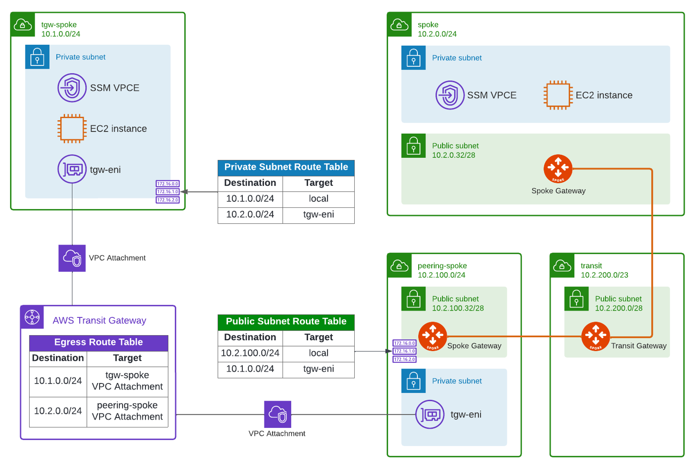

# AWS TGW China region Integration with Aviatrix

Terraform code to demonstrate how to integrate AWS Transit Gateway in China region with Aviatrix.
Note: VPN and AWS TGW VPN is not supported in AWS China

This repository provides a Terraform code that deploys:
- AWS TGW in China region
- AWS Spoke VPC attached to AWS TGW
- Aviatrix Peering Spoke
- Aviatrix Transit
- Aviatrix Spoke
- SSM Profile
- SSM VPC Endpoint in AWS Spoke VPC, Aviatrix Spoke VPC and Aviatrix Peering Spoke VPC
- EC2 instance in AWS Spoke VPC
- EC2 instance in Aviatrix Spoke
- EC2 instance in Peering Spoke (for testing between Aviatrix Spoke and Aviatrix Peering)



## Prerequisites

Please make sure you have:
- 1x Aviatrix Controller 6.7 in China Region
- AWS China region access account on-boarded in Aviatrix

You can optionally edit the terraform.tfvars file

## Environment Variables

To run this project, you will need to set the following environment variables
- AWS_ACCESS_KEY_ID
- AWS_SECRET_ACCESS_KEY
- AWS_DEFAULT_REGION

## Run Locally

Clone the project

```bash
git clone https://github.com/bayupw/terraform-aws-china-tgw-to-aviatrix
```
Go to the project directory

```bash
cd terraform-aws-china-tgw-to-aviatrix
```

Set environment variables

```bash
export AWS_ACCESS_KEY_ID="A1b2C3d4E5"
export AWS_SECRET_ACCESS_KEY="A1b2C3d4E5"
export AWS_DEFAULT_REGION="ap-southeast-2"
```

Update the terraform.tfvars file if required

Terraform workflow

```bash
terraform init
terraform plan
terraform apply -auto-approve
```

## Contributing

Report issues/questions/feature requests on in the [issues](https://github.com/bayupw/terraform-aws-china-tgw-to-aviatrix/issues/new) section.

## License

Apache 2 Licensed. See [LICENSE](https://github.com/bayupw/terraform-aws-china-tgw-to-aviatrix/tree/master/LICENSE) for full details.